# The New AI Gold Rush — Transdimensional Machine Learning (Pan Provided!)

## Mining the Riches of Data w/ Optimal Metrics in Higher Dimensional Manifolds using Hybrid-NEAT w/ UMAP & HDBSCAN.

[Medium Article](https://medium.com/@andycarl_40001/the-new-ai-gold-rush-pan-provided-981c0f96e8e7)

The big advances in AI going forward will NOT be achieved by the direct application of AI/ML/DL tools on munged/wrangled data. But rather by the holistic application of optimal metrics mapped to higher-dimensional manifolds, subsequent application of applicable AI/ML/DL tools, with the entire computational pipeline quantitatively evaluated in the context of use-case specific Fitness Functions!

Using Hybrid-NEAT to control UMAP & HDBSCAN hyperparameters, the true potential becomes evident for practical use-cases. And a new door is opened for the practical realization of Transdimensional Machine Learning (TML) on optimal metrics in higher-dimensional manifolds, for AI embedding, clustering, classification, and regression use-cases.

## An Example:
The “data” is comprised of image RBG pixel data collected from over 2 million chart images, for the intended use-case of segment clustering to identify pixels associated with various chart features. The empirical observation indicated that there were (7) chart features to be identified. As a consequence, the clustering problem was framed to maximize the likelihood of identifying the underlying chart features. Using UMAP & HDBSCAN alone, the clusters were visualized in 2D & 3D as indicated in the below images.

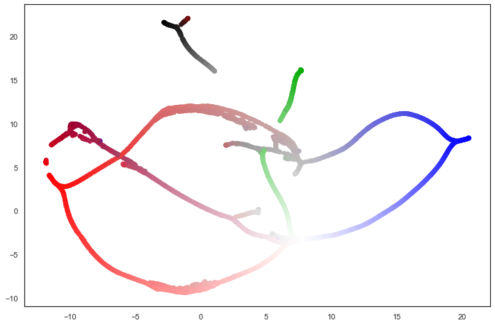
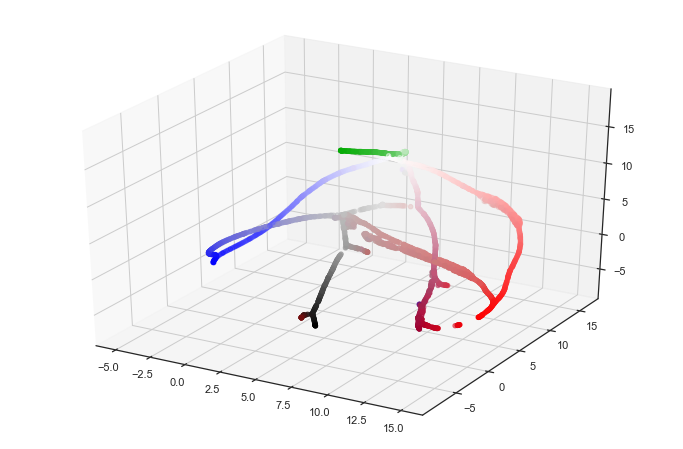

## I. UMAP/HDBSCAN Alone: Simple Repeatability Test (same input run 100x), *Note Negative Fitness (Figures 1A&B)
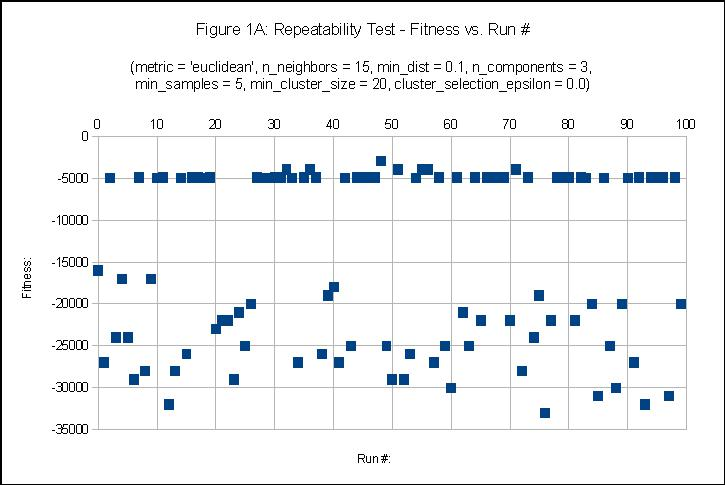
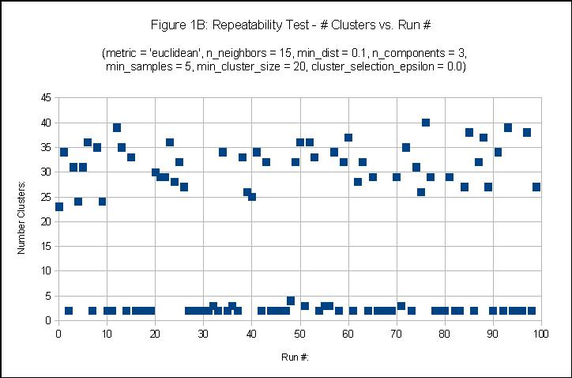

## II. UMAP “Metric” Parameter Study: (Fitness & #Clusters vs. Metric), *Note Negative Fitness (Figures 2A&B)…Not all Metrics are created equal!
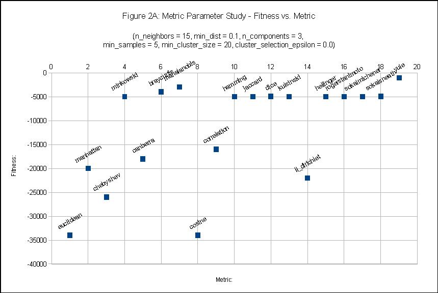

## III. UMAP “N_Neighbors” Parameter Study: (Fitness & #Clusters vs. N_Neighbors), *Note Negative Fitness (Figures 3A&B)
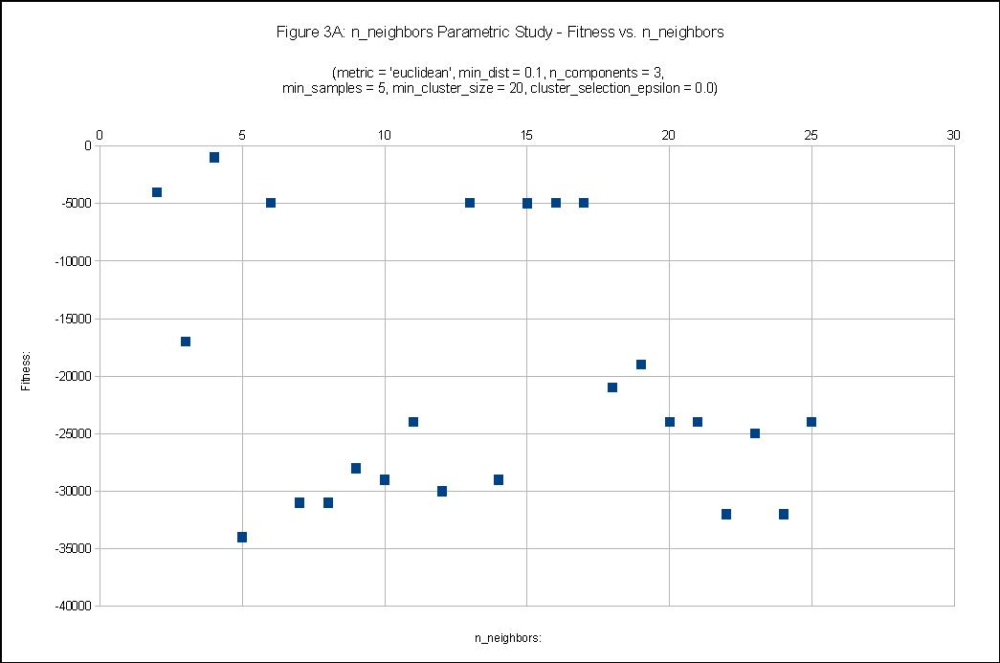
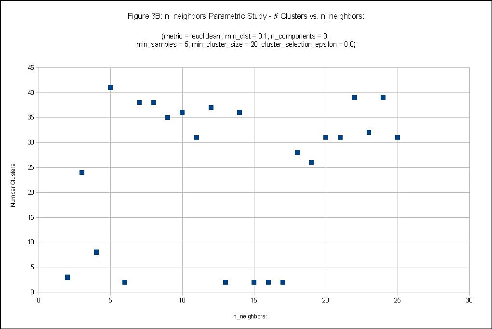

## IV. UMAP “Min_Dist” Parameter Study: (Fitness & #Clusters vs. Min_Dist), *Note Negative Fitness (Figures 4A&B)
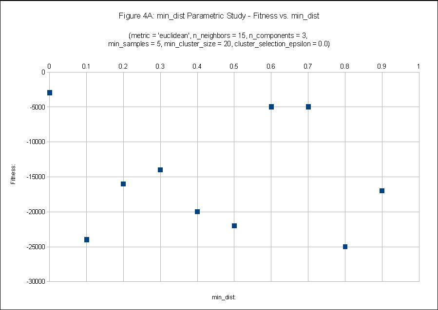
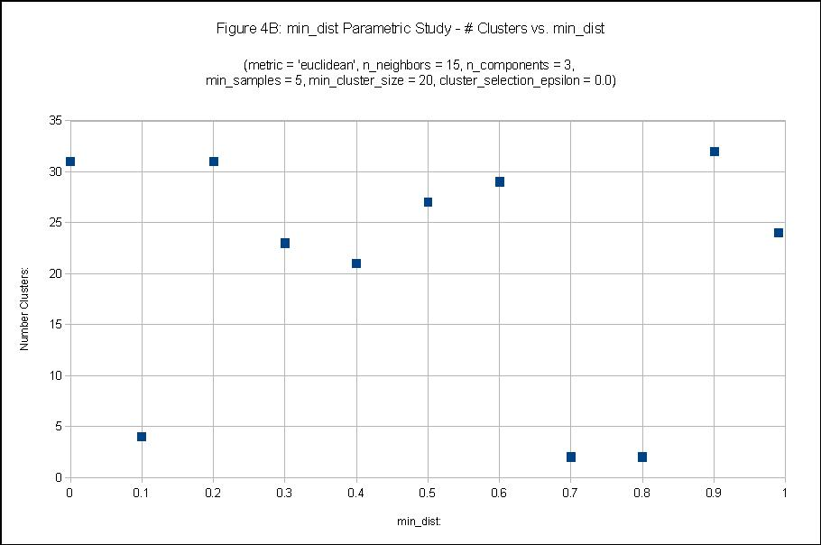

## V. UMAP “N_Components” Parameter Study: (Fitness & #Clusters vs. N_Components), *Note Negative Fitness (Figures 5A&B)
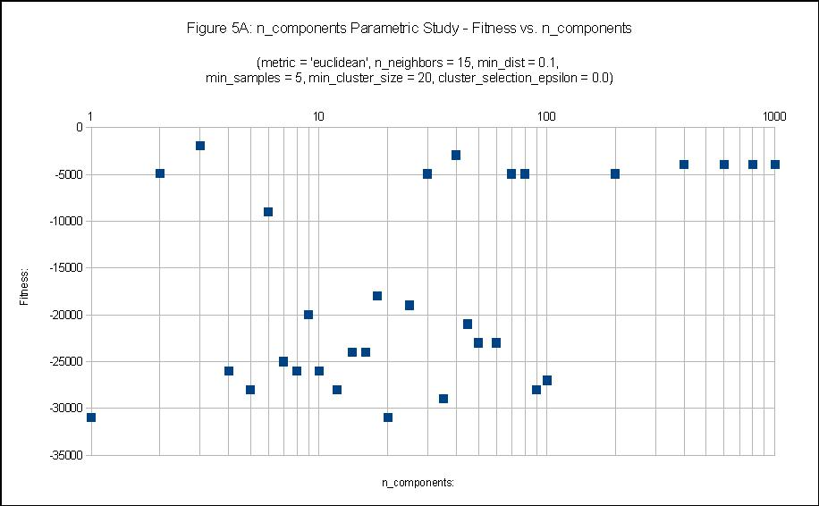
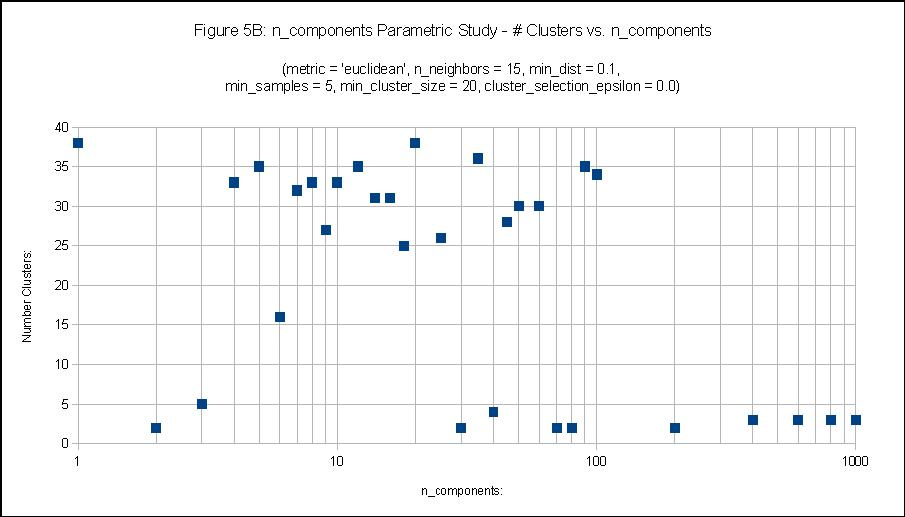

## VI. HDBSCAN “Min_Samples” Parameter Study: (Fitness & #Clusters vs. Min_Samples), *Note Negative Fitness (Figures 6A&B)
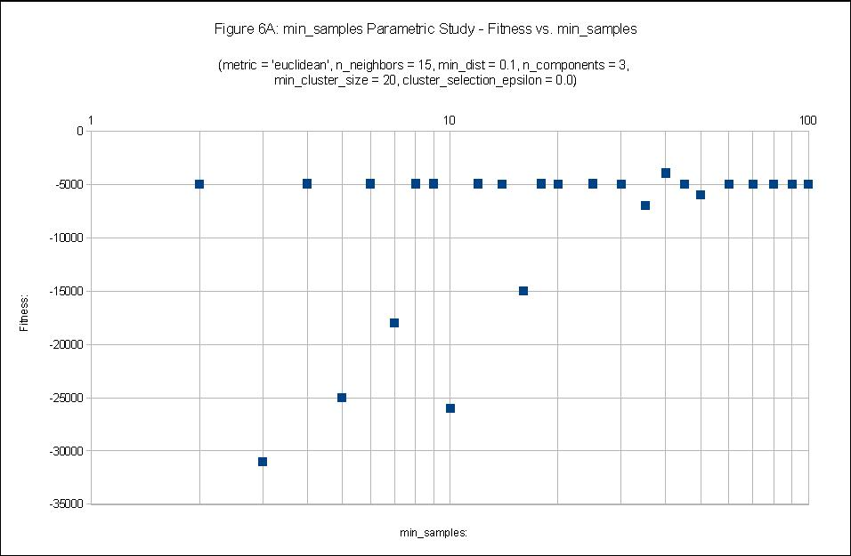
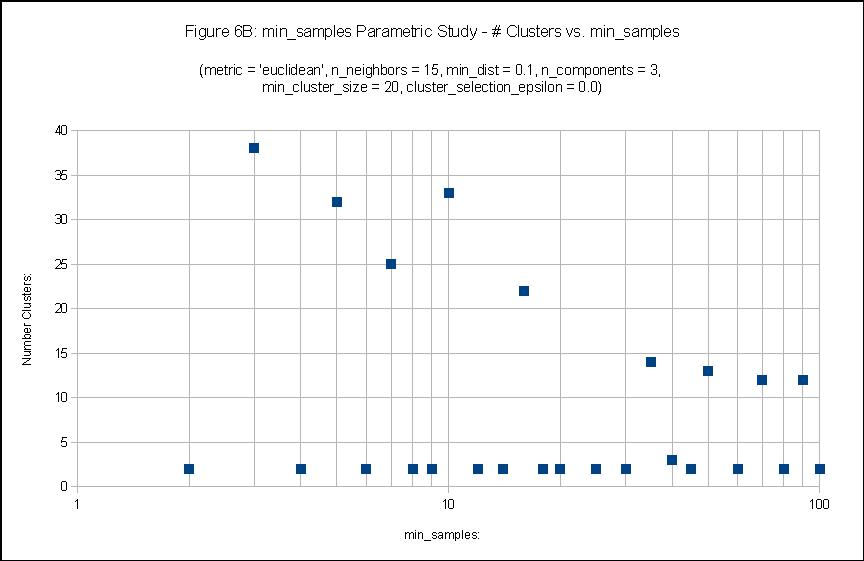

## VII. HDBSCAN “Min_Cluster_Size” Parameter Study: (Fitness & #Clusters vs. Min_Cluster_Size), *Note Negative Fitness (Figures 7A&B)

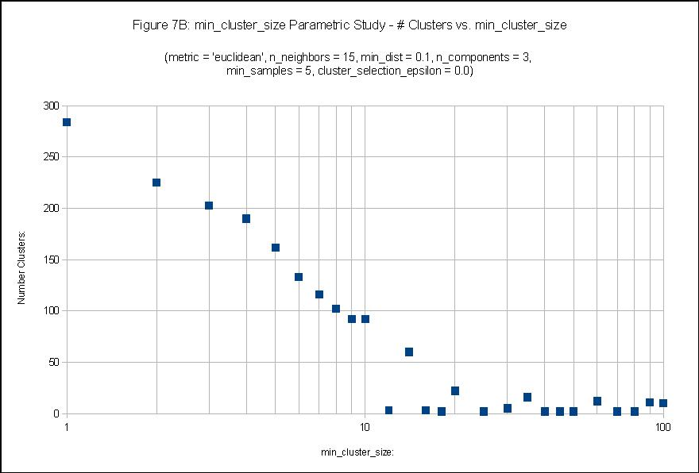

## VIII. HDBSCAN “Cluster_Selection_Epsilon” Parameter Study: (Fitness & #Clusters vs. Cluster_Selection_Epsilon), *Note Negative Fitness (Figures 8A&B)
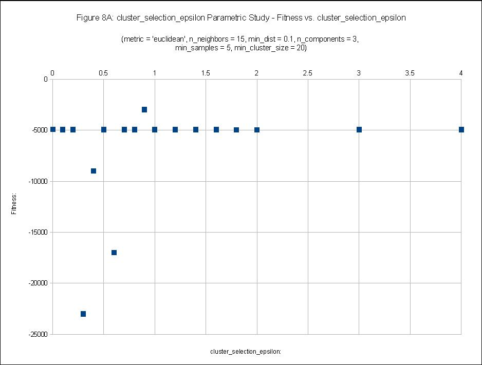
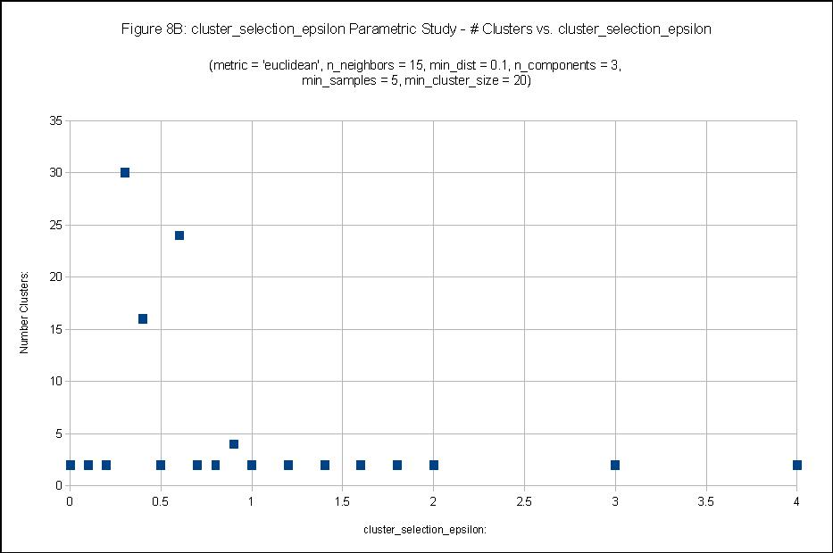

# Hybrid-NEAT:
NEAT stands for “NeuroEvolution of Augmenting Topologies” and was developed by Ken Stanley in 2002 while at The University of Texas at Austin. Hybrid-NEAT is a variant of NEAT, which incorporates elements of local search to assist in establishing the best fitness associated with a given genome, and various other enhancements to improve efficiency and reduce evaluation count associated with the evolutionary methodology.

## IX. Hybrid-NEAT w/ UMAP & HDBSCAN: Best Fitness Trajectory vs. N_Components = 1,2,3,10 & 100, *Note Positive Fitness (Figure 9)
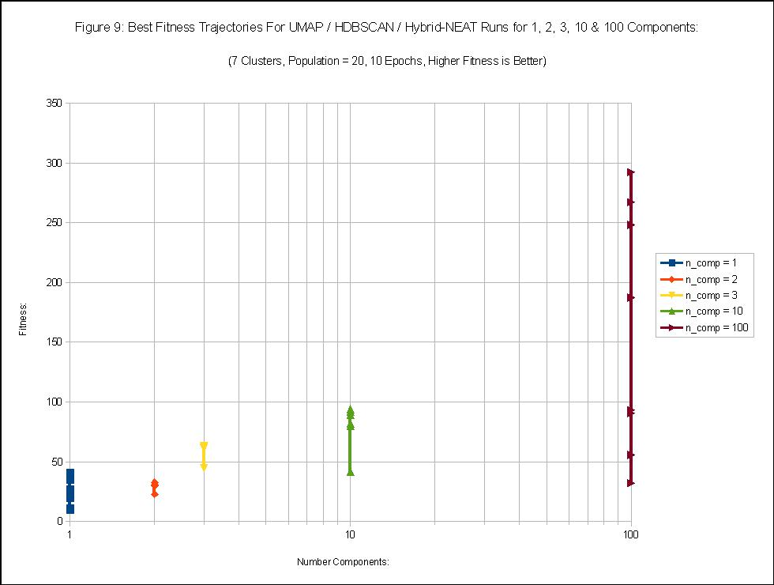

## X. Hybrid-NEAT w/ UMAP & HDBSCAN: Best Fitness Trajectory vs. N_Components = 1-to-1000, *Note Positive Fitness (Figure 10)
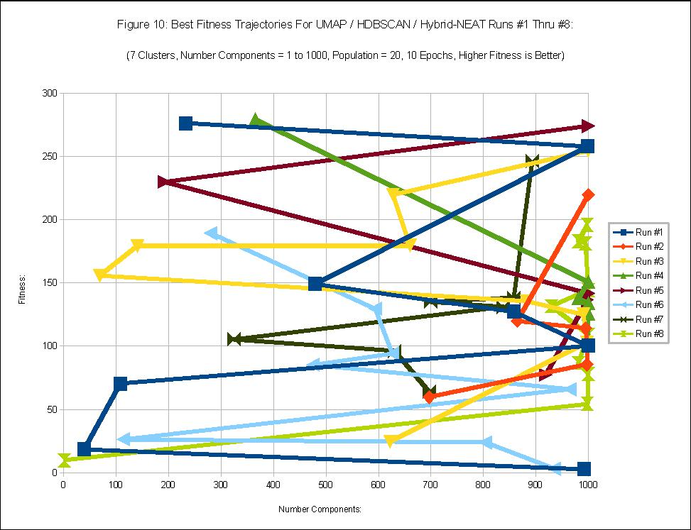

# Summary:
 - Not all metrics are created equal!

 - Even for the same data, there is an infinite number of combinations of metrics, higher-dimensional manifolds, and Fitness functions. And they each perform differently for your specific use-case! Using Hybrid-NEAT you can mine for the results that satisfy your use-case best!

 - A Fitness function is simply an embodiment of the intended use-case.

 - You can create your own unique metric to maximize your Fitness function for your specific use-case and quantitatively evaluate its effectiveness.

 - Be creative and think outside-the-box!

 - Hybrid-NEAT provides the flexibility, control, and robustness in challenging applications involving non-linear, discontinuous, and non-smoothly differentiable hyperspaces common to practical real-world use-cases.

 - UMAP & HDBSCAN, when used with Hybrid-NEAT, is NOT simply a clustering tool! But can be used as a proxy for developing optimal AI embeddings, separation of datasets as a potential precursor step for classification, regression, or clustering use-cases. Comprising input to all manor of AI ML & DL tools. Only limited by the size of your cluster and imagination!

 - Transdimensional Machine Learning (TML) could be defined as the holistic application perspective viewing data, metric selection/creation, manifold mapping, AI/ML/DL tool selection, and fitness function determination, driven only by the specifics of the intended use-case, and more importantly, independent of concern of the dimensionality of the underlying raw data and manifold mapping dimension.

## Inspiration:
 - UMAP, Leland McInnes
 - HDBSCAN, Leland McInnes, John Healy, Steve Astels
 - NEAT, Kenneth Stanley
 - How Exactly UMAP Works, Nikolay Oskolkov
 - How to Program UMAP from Scratch, Nikolay Oskolkov
 - How to cluster in High Dimensions, Nikolay Oskolkov
 - tSNE vs. UMAP: Global Structure, Nikolay Oskolkov
 - Why UMAP is Superior over tSNE, Nikolay Oskolkov

### License
The package is 3-clause BSD licensed.